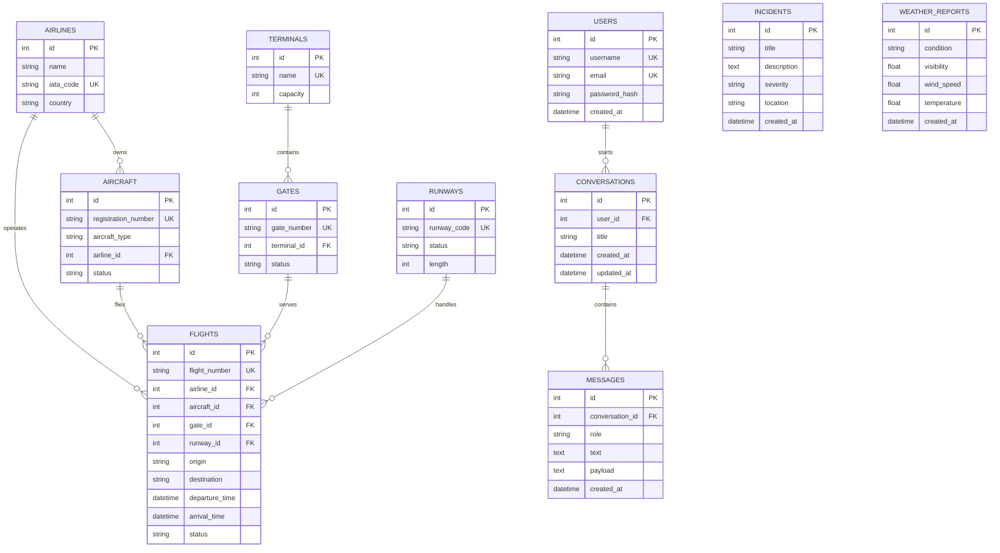

# AeroMind - Airport Operations AI Agent

AeroMind is a university final project: an airport operations backend with an
AI agent layer built on the Gemini API.

The backend provides the data foundation (PostgreSQL schema, JWT
authentication, migrations, seed data, REST endpoints) and the agent layer
turns natural-language questions into answers grounded in that data.

The agent exposes 22 function tools and runs a full agentic loop: Gemini
decides which tools to call, the backend executes them against PostgreSQL,
the results are fed back, and the loop repeats until Gemini can answer.
Multi-step reasoning across several tools in a single request is supported,
the agent can modify data as well as read it, and conversations are
remembered so follow-up questions work.

## Tech Stack

- Python 3.12
- Flask
- SQLAlchemy
- PostgreSQL
- Flask-Migrate
- Flask-JWT-Extended
- Docker and Docker Compose
- Google Gemini API (google-genai)
- React 19, TypeScript, Vite and Tailwind CSS

## Project Structure

```text
backend/
├── app.py
├── config.py
├── models/
├── routes/
├── repositories/
├── services/
├── database/
├── migrations/
├── seed/
├── tests/
└── requirements.txt
frontend/
├── src/
├── package.json
└── vite.config.ts
docker-compose.yml
Dockerfile
.env.example
README.md
docs/API_TESTS.md
```

## Database Schema

Eleven tables in two groups. Six operational tables are connected through
foreign keys around the central `flights` table. `conversations` and
`messages` store chat history and hang off `users`. `incidents` and
`weather_reports` are standalone records the agent reads and writes.



### Relationships

| From | To | Type | Meaning |
| --- | --- | --- | --- |
| `airlines` | `aircraft` | one-to-many | An airline owns several aircraft |
| `airlines` | `flights` | one-to-many | An airline operates several flights |
| `aircraft` | `flights` | one-to-many | An aircraft flies several flights over time |
| `terminals` | `gates` | one-to-many | A terminal contains several gates |
| `gates` | `flights` | one-to-many | A gate serves several flights over time |
| `runways` | `flights` | one-to-many | A runway handles several flights |
| `users` | `conversations` | one-to-many | A user starts several chat threads |
| `conversations` | `messages` | one-to-many | A thread holds the turns of the chat |

Every foreign key on `flights` is `NOT NULL`: a flight cannot exist without
an airline, an aircraft, a gate and a runway.

### Table notes

- **airlines** - `iata_code` is the unique two letter carrier code.
- **aircraft** - `status` is one of `available`, `in_service`, `maintenance`.
- **terminals** - `capacity` is the number of passengers the terminal handles.
- **gates** - `status` is one of `available`, `occupied`, `maintenance`. A gate
  is released automatically when its last flight moves away.
- **runways** - `status` is one of `available`, `maintenance`, `closed`, and
  `length` is in metres.
- **flights** - `status` is one of `scheduled`, `boarding`, `departed`,
  `arrived`, `delayed`, `cancelled`.
- **incidents** - `severity` is one of `low`, `medium`, `high`, `critical`.
  Created by staff or by the agent through the `create_incident` tool.
- **weather_reports** - append only; the agent reads the most recent row.
- **users** - passwords are stored as salted hashes, never in plain text.
- **conversations** - one chat thread. `updated_at` moves on every reply,
  so the list endpoint can show the most recently used thread first.
- **messages** - one turn. `payload` holds the serialised Gemini content so
  tool calls and results can be replayed exactly; `text` is the readable
  part, and is empty for tool turns. Deleting a conversation deletes its
  messages.

## Quick Start With Docker

Copy the environment file and add your Gemini API key:

```bash
cp .env.example .env
```

Build and start the Flask API and PostgreSQL:

```bash
docker compose up --build
```

The API will be available at `http://localhost:5000`.

Docker Compose does not start the React frontend. In a separate terminal,
install its dependencies, copy its environment file and start Vite:

```bash
cd frontend
npm install
cp .env.example .env
npm run dev
```

The frontend will be available at `http://localhost:5173`.

Health check:

```bash
curl http://localhost:5000/health
```

## Environment Variables

- `DATABASE_URL`: SQLAlchemy PostgreSQL connection URL
- `JWT_SECRET_KEY`: secret used to sign JWT access tokens
- `FLASK_DEBUG`: set to `1` to enable the reloader and debug output
- `GEMINI_API_KEY`: API key used by the agent, required for `/agent/query`
- `GEMINI_MODEL`: model name, defaults to `gemini-3.5-flash`
- `VITE_API_URL`: backend base URL used by the React frontend; set it in
  `frontend/.env` (defaults to `http://localhost:5000`)

Docker Compose provides development defaults for the database and JWT secret,
but `GEMINI_API_KEY` must come from your own `.env` file.

The values in `docker-compose.yml` are development settings only. A real
deployment must supply its own `JWT_SECRET_KEY`, run with `FLASK_DEBUG`
unset and serve the app through a production WSGI server rather than the
Flask development server.

## Database Setup

Apply the migrations:

```bash
docker compose exec api flask db upgrade
```

Seed the database:

```bash
docker compose exec api python seed/seed_data.py
```

The seed script creates:

- 5 airlines
- 25 aircraft
- 3 terminals
- 36 gates
- 3 runways
- 150 flights
- 30 weather reports
- 30 incidents

## AI Agent

The agent is composed of five services under `backend/services/`:

| File | Responsibility |
| --- | --- |
| `gemini_service.py` | Gemini client, tool declarations, model calls |
| `agent_service.py` | The agentic loop and system prompt |
| `tool_registry.py` | Maps tool names to functions and JSON schemas |
| `tool_executor.py` | Executes a tool by name and normalises errors |
| `memory_service.py` | Stores and replays conversation history |
| `*_tools.py` | The tools themselves, backed by the repositories |

### How the loop works

```text
User question
    ↓
Gemini (sees all 22 tool declarations)
    ↓
requests one or more tools
    ↓
ToolExecutor → repositories → PostgreSQL
    ↓
results returned to Gemini
    ↓
repeat until Gemini answers (max 5 iterations)
    ↓
Final answer
```

### Verified three-tool workflow

The agent test suite verifies a chained request asking where flight `TA1000`
departs from. The agent first calls `get_flight_by_number`, then
`get_terminal_status`, and finally `get_flights_by_terminal` before returning
its answer. This confirms that later tool calls can use context gathered in
earlier iterations of the same request.

### Available tools

Twenty-two tools, grouped by what they do.

**Read**

| Area | Tools |
| --- | --- |
| Flights | `get_all_flights`, `get_flight_by_id`, `get_flight_by_number`, `find_delayed_flights` |
| Gates | `get_all_gates`, `get_gate_by_id`, `get_gate_by_number`, `get_available_gates` |
| Runways | `get_runway_status`, `get_runway_by_id`, `get_runway_by_code` |
| Terminals | `get_flights_by_terminal`, `get_terminal_status` |
| Incidents | `get_all_incidents`, `get_incidents_by_severity` |
| Weather | `get_latest_weather` |

**Search and filter**

| Tool | What it does |
| --- | --- |
| `search_flights` | Combines origin, destination, status and airline with partial, case-insensitive matching |
| `search_incidents` | Free text across title, description and location |

**Write**

| Tool | What it does |
| --- | --- |
| `create_incident` | Logs a new incident |
| `update_flight_status` | Changes a flight's operational status |
| `assign_flight_to_gate` | Moves a flight to a free gate and releases the previous one when it empties |
| `update_runway_status` | Opens or closes a runway and reports the flights it affects |

Every write tool validates its input and returns an error payload the model
can read, so a rejected change is explained to the user instead of surfacing
as a server error.

### Conversation memory

Gemini is stateless: every request must carry the whole conversation. Each
turn is therefore stored and replayed on the next question, so follow-ups
work:

```text
"Which flights are delayed?"          -> starts a thread, returns its id
"And which of those are at Terminal B?" -> same id, the agent knows "those"
```

Turns are stored as the serialised Gemini content rather than as plain
text, so tool calls and tool results are replayed exactly as the model
produced them. Only the most recent thirty turns are replayed, which keeps
a long thread from growing the prompt without bound. A conversation is
scoped to the user who started it and cannot be read by anyone else.

## React Frontend

The React application in `frontend/` provides the operator-facing interface:

- **Login/Register** - creates an account or signs in and stores the JWT for
  authenticated requests.
- **Dashboard** - shows live flight, gate, incident and weather data from the
  API.
- **AI Chat** - sends operations questions to the agent and supports follow-up
  questions in the same thread.
- **Conversation History** - lists saved threads and lets the user reopen or
  delete them.
- **Tool Call Display** - shows the tools, arguments and success or failure
  status returned with each agent answer.

For more frontend-specific setup and architecture details, see
[frontend/README.md](frontend/README.md).

### Transient failures

The free Gemini tier returns `429` when rate limited and `503` when the
model is under load. Both clear within seconds, so the client retries up to
three times with a growing delay before giving up. If every attempt fails,
`/agent/query` answers `503` with `"retryable": true` rather than a generic
server error. Permanent errors, such as a malformed request, are not
retried.

## API Endpoints

Authentication:

| Method | Endpoint | Auth | Description |
| --- | --- | --- | --- |
| POST | `/auth/register` | - | Register a user |
| POST | `/auth/login` | - | Login and receive a JWT access token |
| PATCH | `/auth/me` | JWT | Update your own username, email or password |

AI agent:

| Method | Endpoint | Auth | Description |
| --- | --- | --- | --- |
| POST | `/agent/query` | JWT | Ask the agent an operations question |
| GET | `/agent/conversations` | JWT | List your conversations |
| GET | `/agent/conversations/<id>` | JWT | Read one conversation with its turns |
| DELETE | `/agent/conversations/<id>` | JWT | Delete a conversation |

Operations:

| Method | Endpoint | Auth | Description |
| --- | --- | --- | --- |
| GET | `/flights` | - | List flights |
| GET | `/flights/search` | - | Search by origin, destination, status or airline |
| GET | `/flights/<id>` | - | Get one flight |
| PATCH | `/flights/<id>/status` | JWT | Change a flight's status |
| PATCH | `/flights/<id>/gate` | JWT | Move a flight to another gate |
| GET | `/gates` | - | List gates |
| GET | `/runways` | - | List runways |
| PATCH | `/runways/<id>/status` | JWT | Open or close a runway |
| GET | `/terminals` | - | List terminals with gate availability |
| GET | `/terminals/<id>/flights` | - | Flights using a terminal's gates |
| GET | `/incidents` | - | List incidents |
| GET | `/incidents/search` | - | Search incidents by free text |
| POST | `/incidents` | JWT | Create an incident |
| GET | `/weather` | - | List weather reports |
| POST | `/weather` | JWT | Create a weather report |

Twenty-two endpoints in total. `GET /` lists them all, and `GET /health`
reports both service and database status.

Listing endpoints eager-load their related rows, so `GET /flights` runs a
single query regardless of how many flights are returned.

See [docs/API_TESTS.md](docs/API_TESTS.md) for copy-pasteable requests.

### Example: register and login

```bash
curl -X POST http://localhost:5000/auth/register \
  -H "Content-Type: application/json" \
  -d '{"username":"admin","email":"admin@example.com","password":"password123"}'

curl -X POST http://localhost:5000/auth/login \
  -H "Content-Type: application/json" \
  -d '{"email":"admin@example.com","password":"password123"}'
```

### Example: ask the agent

```bash
curl -X POST http://localhost:5000/agent/query \
  -H "Authorization: Bearer <access_token>" \
  -H "Content-Type: application/json" \
  -d '{"message":"Which flights are delayed and which gates are free?"}'
```

The response contains the answer, the tools the agent executed, and the id
of the conversation:

```json
{
  "data": {
    "answer": "...",
    "tool_calls": [
      {"tool": "find_delayed_flights", "arguments": {}, "failed": false},
      {"tool": "get_available_gates", "arguments": {}, "failed": false}
    ],
    "conversation_id": 1
  }
}
```

Send that id back with the next question to continue the thread:

```bash
curl -X POST http://localhost:5000/agent/query \
  -H "Authorization: Bearer <access_token>" \
  -H "Content-Type: application/json" \
  -d '{"message":"And which of those are at Terminal B?","conversation_id":1}'
```

## Testing

The suite runs against an in-memory SQLite database, so it needs no running
PostgreSQL:

```bash
docker compose exec api pytest -q
```

It covers the tool executor, the agentic loop (parallel calls, chained calls
and the iteration limit), the search and update tools, and the HTTP layer
with its authentication and error paths.
